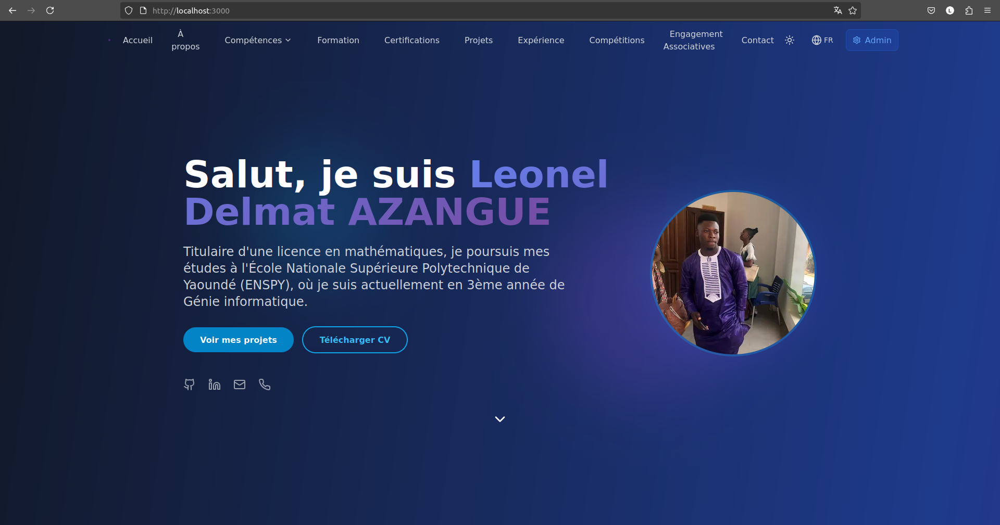
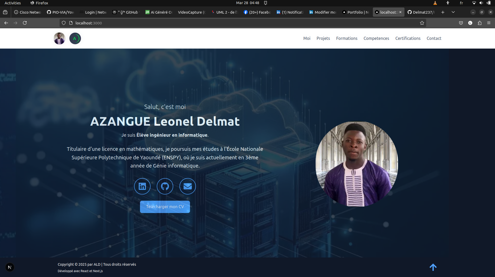
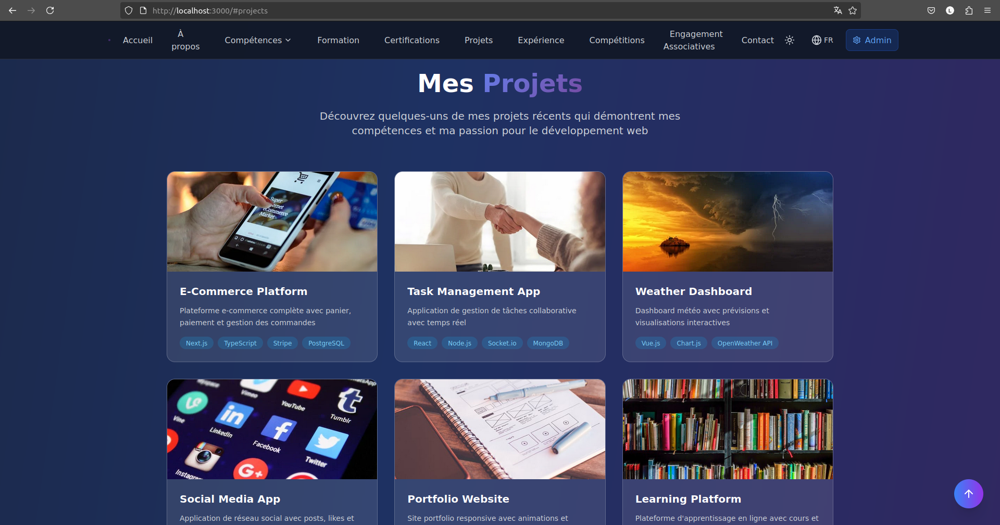
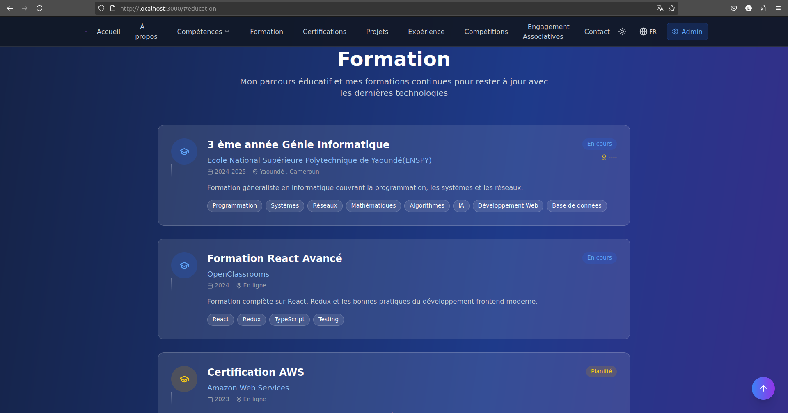
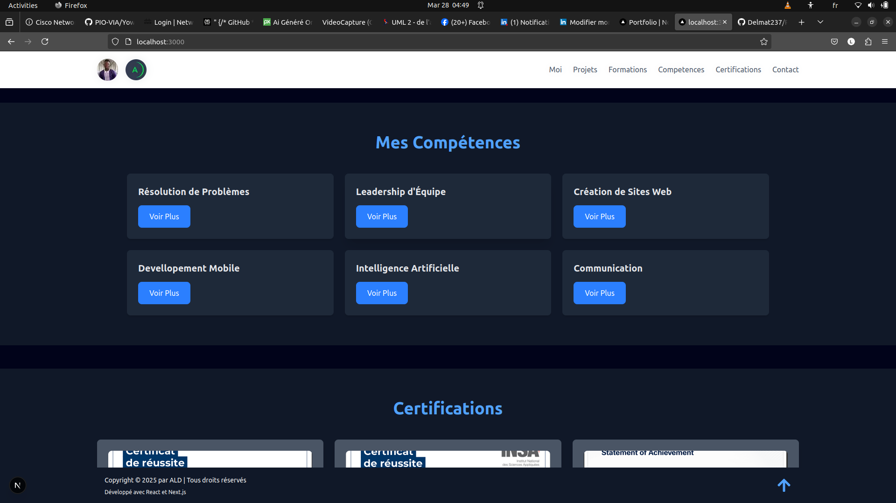
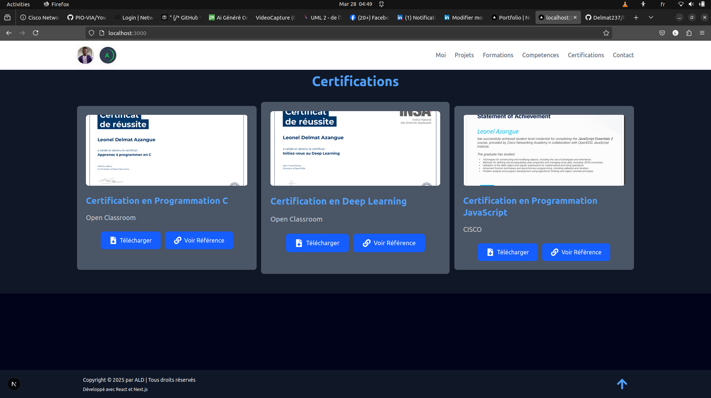
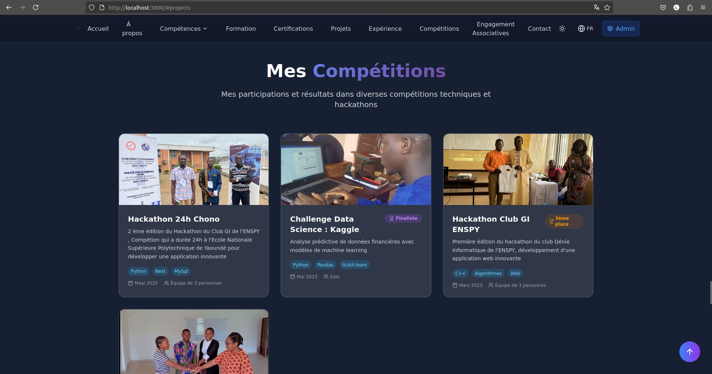
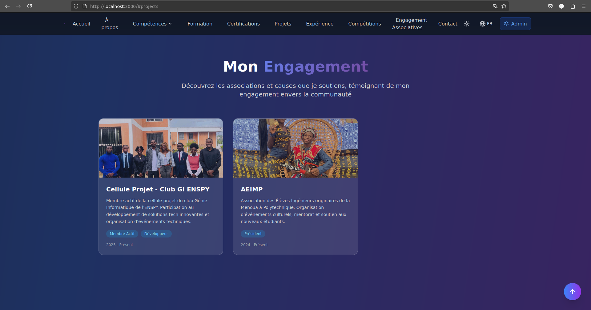
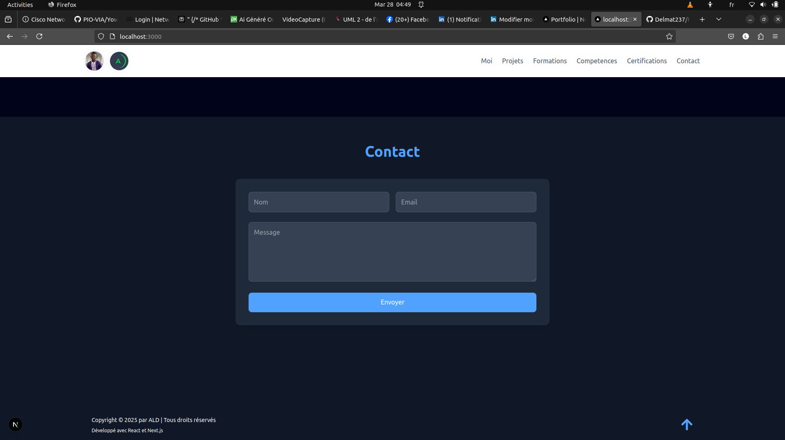

# Portfolio de AZANGUE Leonel Delmat

Bienvenue sur mon portfolio en ligne ! Ce dépôt contient le code source de mon site web personnel, où je présente mes projets, mes compétences, ma formation et mes certifications.

## Aperçu

Voici un aperçu de la page d'accueil de mon portfolio :



*Ce screenshot montre la section d'accueil, avec une brève introduction à mon parcours et un aperçu de mon profil.*

## Sections principales

Mon portfolio est organisé en plusieurs sections clés :

### 1. À propos de moi

*Présentation personnelle, parcours académique et professionnel.*



*Exemple de description : Cette section détaille mon expérience à l'ENSPY, mes motivations et mes objectifs professionnels.*

### 2. Projets

*Présentation de mes projets personnels et académiques, avec des liens vers les dépôts GitHub et les démos.*



*Exemple de description : Cette section met en avant mes compétences techniques à travers des exemples concrets de projets réalisés.*

### 3. Formations

*Détails de mon parcours académique, incluant les diplômes obtenus et les établissements fréquentés.*



*Exemple de description : Cette section récapitule mon parcours scolaire, depuis la licence en mathématiques jusqu'à mon cursus actuel en Génie Informatique.*

### 4. Compétences

*Liste de mes compétences techniques et personnelles, avec une indication de mon niveau de maîtrise.*



*Exemple de description : Cette section met en évidence mes points forts, tels que la résolution de problèmes, le leadership d'équipe et la communication.*

### 5. Certifications

*Liste de mes certifications professionnelles, avec des liens vers les justificatifs.*



*Exemple de description : Cette section présente mes certifications, notamment en programmation C, obtenues auprès d'organismes reconnus.*

### 6. Compétitions

*Liste de mes compétitions professionnelles, avec des liens vers les justificatifs.*



*Exemple de description : Cette section présente mes compétitions, notamment Hackathon, 24h chrono, participées auprès d'organismes reconnus.*

### 7. Engagement associatif

*Liste de mes engagements envers la société, avec des liens vers les justificatifs.*



*Exemple de description : Cette section présente mes engagements associatifs, notamment président de l'AEIMP.*

### 8. Contact

*Formulaire de contact pour me joindre directement.*



*Exemple de description : N'hésitez pas à me contacter via ce formulaire pour toute question ou opportunité de collaboration.*

## Technologies utilisées

Ce portfolio a été développé avec les technologies suivantes :

* **React** : Bibliothèque JavaScript pour la construction d'interfaces utilisateur.
* **Next.js** : Framework React pour le rendu côté serveur et la génération de sites statiques.
* **Tailwind CSS** : Framework CSS pour un styling rapide et efficace.
* **lucide-react** : Bibliothèque d'icônes React.
* **Framer Motion** : Animations et transitions fluides.
* **TypeScript** : Typage statique pour une meilleure maintenabilité.
* **Prisma** : ORM pour la persistance PostgreSQL.
* **PostgreSQL** : Base de données (Supabase, Neon, Vercel Postgres, etc.).

## Installation et utilisation

Pour exécuter ce portfolio en local :

1. Clonez le dépôt : `git clone https://github.com/Delmat237/Portfolio.git`
2. Naviguez vers le répertoire : `cd Portfolio`
3. Installez les dépendances : `npm install` ou `yarn install`
4. Copiez le fichier d'exemple de configuration : `cp .env.local.example .env.local`
5. Configurez la base de données et les variables d'environnement (voir ci-dessous)
6. Lancez le serveur de développement : `npm run dev` ou `yarn dev`
7. Ouvrez votre navigateur à l'adresse `http://localhost:3000`

### Configuration base de données

Le portfolio utilise **Prisma + PostgreSQL** (compatible Supabase, Neon, Vercel Postgres).

1. Créez une base PostgreSQL (ex. [Supabase](https://supabase.com) → *New project* → *Settings* → *Database* → *Connection string* → mode **URI**).
2. Ajoutez l'URL dans `.env.local` :
   ```
   DATABASE_URL=postgresql://...
   ADMIN_PASSWORD=votre-mot-de-passe-admin
   ```
3. Appliquez le schéma et peuplez les données initiales :
   ```bash
   npm run db:push
   npm run db:seed
   ```
4. Accédez à `/admin`, connectez-vous avec `ADMIN_PASSWORD`.

Les modifications admin sont persistées en base et visibles par **tous les visiteurs** en production.

Sans `DATABASE_URL`, le site utilise les fichiers `data/*.ts` en fallback (développement local).

### Variables d'environnement

Voir `.env.local.example` pour la liste complète des variables :

* `DATABASE_URL` — connexion PostgreSQL (obligatoire en production)
* `ADMIN_PASSWORD` — mot de passe de l'espace admin (serveur uniquement)
* `ADMIN_API_SECRET` — optionnel, signature des sessions et token Bearer API
* `EMAIL_HOST`, `EMAIL_PORT`, `EMAIL_SECURE`, `EMAIL_USER`, `EMAIL_PASS` — configuration SMTP pour le formulaire de contact
* `CLOUDINARY_CLOUD_NAME`, `CLOUDINARY_API_KEY`, `CLOUDINARY_API_SECRET` — upload d'images via l'espace admin (route `/api/upload`, dossier `portfolio` sur Cloudinary)
* `CLOUDINARY_UPLOAD_PRESET` — optionnel, uniquement si vous utilisez un preset unsigned

### Déploiement Vercel

1. Poussez le code sur GitHub et importez le projet dans Vercel.
2. Ajoutez les variables d'environnement (`DATABASE_URL`, `ADMIN_PASSWORD`, etc.) dans *Settings* → *Environment Variables*.
3. Utilisez une base externe (Supabase/Neon) — le filesystem Vercel n'est pas persistant.
4. Après le premier déploiement, exécutez localement :
   ```bash
   DATABASE_URL="..." npm run db:push
   DATABASE_URL="..." npm run db:seed
   ```

### Upload d'images (admin)

Dans l'espace admin (`/admin`), les formulaires projets et formations permettent d'ajouter une image de deux façons :

1. **Lien URL** — coller l'URL d'une image existante
2. **Upload** — envoyer un fichier vers Cloudinary via la route API sécurisée `/api/upload`

Créez un compte sur [Cloudinary](https://cloudinary.com/), récupérez vos identifiants dans le Dashboard, puis renseignez-les dans `.env.local`. L'upload requiert une session admin valide (cookie httpOnly après connexion à `/admin`).

> **Note :** Les compétences (`skills`) et technologies (`tech`) restent dans `data/*.ts` (contenu statique avec icônes). Les entités portfolio (projets, formations, expériences, compétitions, associations, certifications) sont en base. L'admin CRUD complet est disponible pour projets, formations et expériences ; les autres entités sont exposées via API et modifiables via les routes REST.

## Contribution

Les contributions sont les bienvenues ! Si vous souhaitez améliorer ce portfolio, n'hésitez pas à soumettre une *pull request*.

### Contact

Vous pouvez me contacter via les plateformes suivantes :

* <a href="https://wa.me/237694773472" target="_blank">  WhatsApp</a>: +237694773472
* <a href="mailto:azangueleonel9@gmail.com">  Email</a>: azangueleonel9@gmail.com
* <a href="https://github.com/Delmat237" target="_blank">  GitHub</a>: Delmat237
* <a href="https://www.linkedin.com/in/leonel-azangue" target="_blank">  LinkedIn</a>: Leonel Azangue

## Licence

Ce projet est sous licence [MIT](LICENSE) - voir le fichier [LICENSE](LICENSE) pour plus de détails.
