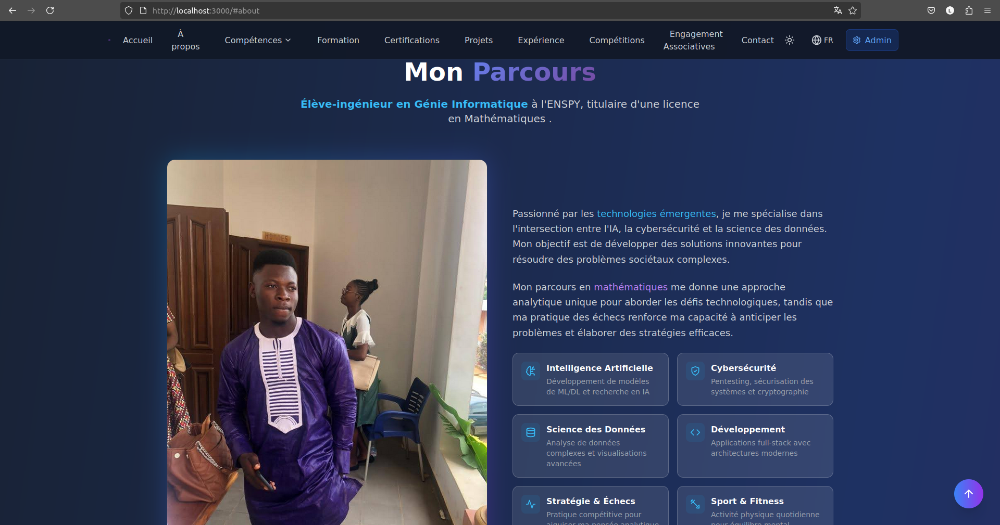
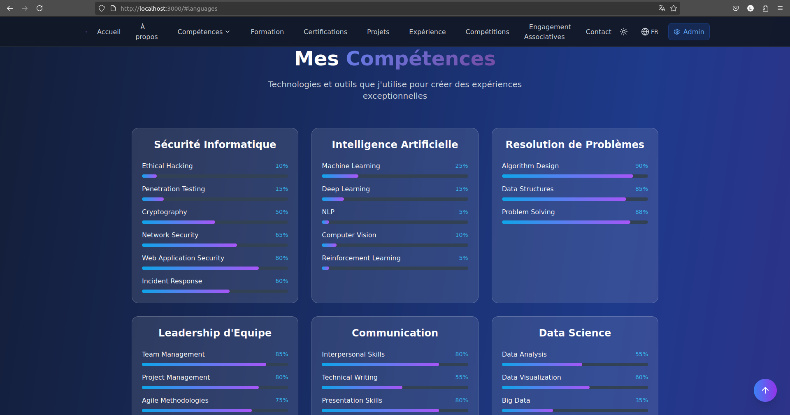
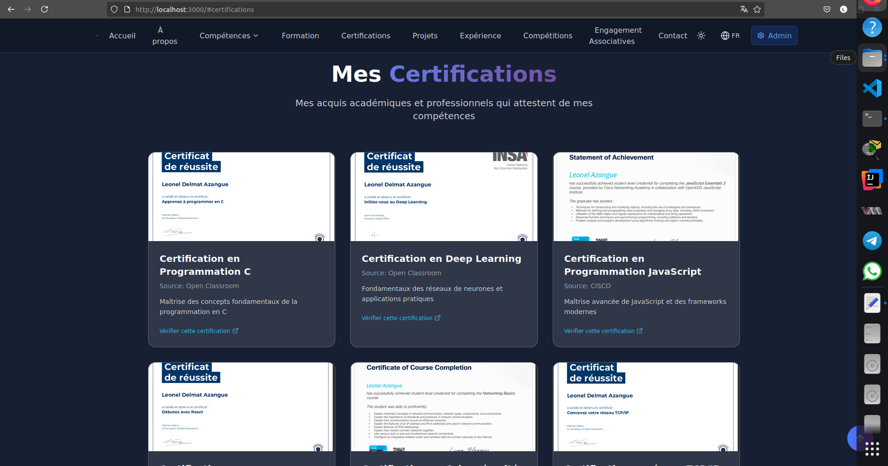
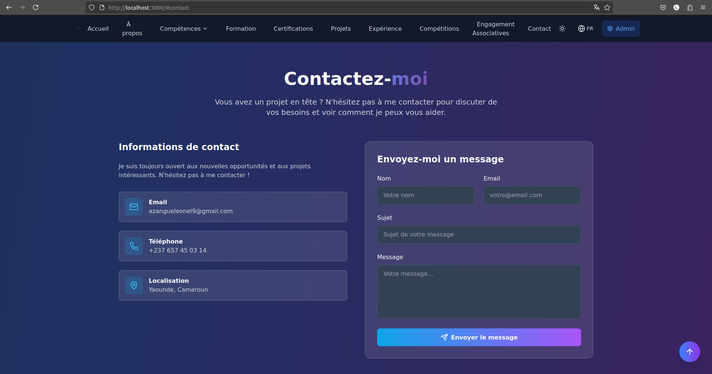

# Portfolio de AZANGUE Leonel Delmat

Bienvenue sur mon portfolio en ligne! Ce dépôt contient le code source de mon site web personnel, où je présente mes projets, mes compétences, ma formation et mes certifications.

## Aperçu

Voici un aperçu de la page d'accueil de mon portfolio :

*Ce screenshot montre la section d'accueil, avec une brève introduction à mon parcours et un aperçu de mon profil.*

## Sections principales

Mon portfolio est organisé en plusieurs sections clés :

### 1. À propos de moi

*Présentation personnelle, parcours académique et professionnel.*

*Exemple de description : Cette section détaille mon expérience à l'ENSPY, mes motivations et mes objectifs professionnels.*

### 2. Projets

*Présentation de mes projets personnels et académiques, avec des liens vers les dépôts GitHub et les démos.*

*Exemple de description : Cette section met en avant mes compétences techniques à travers des exemples concrets de projets réalisés.*

### 3. Formations

*Détails de mon parcours académique, incluant les diplômes obtenus et les établissements fréquentés.*

*Exemple de description : Cette section récapitule mon parcours scolaire, depuis la licence en mathématiques jusqu'à mon cursus actuel en Génie Informatique.*

### 4. Compétences

*Liste de mes compétences techniques et personnelles, avec une indication de mon niveau de maîtrise.*

*Exemple de description : Cette section met en évidence mes points forts, tels que la résolution de problèmes, le leadership d'équipe et la communication.*

### 5. Certifications

*Liste de mes certifications professionnelles, avec des liens vers les justificatifs.*

*Exemple de description : Cette section présente mes certifications, notamment en programmation C, obtenues auprès d'organismes reconnus.*

### 6. Contact

*Formulaire de contact pour me joindre directement.*

*Exemple de description : N'hésitez pas à me contacter via ce formulaire pour toute question ou opportunité de collaboration.*

## Technologies utilisées

Ce portfolio a été développé avec les technologies suivantes :

*   **React** : Bibliothèque JavaScript pour la construction d'interfaces utilisateur.
*   **Next.js** : Framework React pour le rendu côté serveur et la génération de sites statiques.
*   **Tailwind CSS** : Framework CSS pour un styling rapide et efficace.
*   **react-icons**: Bibliothèque d'icônes React.

## Installation et utilisation

Pour exécuter ce portfolio en local :

1.  Clonez le dépôt : `git clone https://github.com/Delmat237/Portfolio.git`
2.  Naviguez vers le répertoire : `cd Portfolio`
3.  Installez les dépendances : `npm install` ou `yarn install`
4.  Lancez le serveur de développement : `npm run dev` ou `yarn dev`
5.  Ouvrez votre navigateur à l'adresse `http://localhost:3000`

## Contribution

Les contributions sont les bienvenues ! Si vous souhaitez améliorer ce portfolio, n'hésitez pas à soumettre une *pull request*.

###  Contact

Vous pouvez me contacter via les plateformes suivantes :
- **WhatsApp** : [+237657450314](https://wa.me/237657450314)
- **Email** : [azangueleonel9@gmail.com](mailto:azangueleonel9@gmail.com)
- **GitHub** : [Delmat237](https://github.com/Delmat237)
- **LinkedIn** : [Leonel Azangue](https://www.linkedin.com/in/leonel-azangue)

## Licence

Ce projet est sous licence [MIT](LICENSE) - voir le fichier [LICENSE](LICENSE) pour plus de détails.

